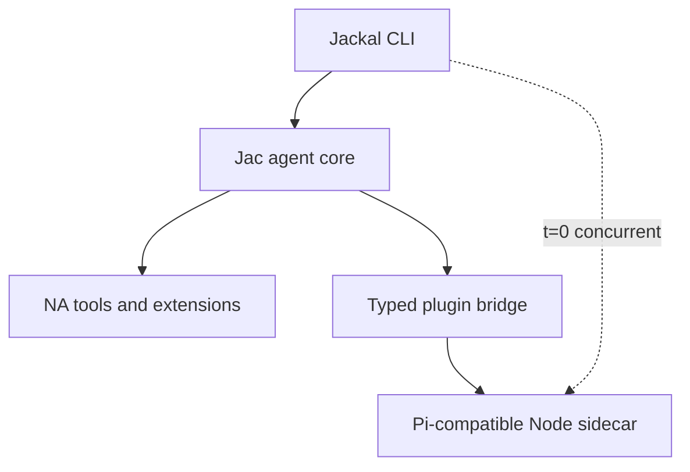

# Jackal Roadmap

**Updated:** 2026-08-30
**Product:** a fast native coding agent with a compatible JavaScript extension layer.

> **Positioning:** fx's form factor + Pi's ecosystem + Jac's codespace architecture. Jackal is a small native runtime with instant interactive startup; configured JavaScript extensions run in a concurrent Pi-compatible Node sidecar that must not block the first frame. See [`docs/NA-HARNESS-EXPLORATION.md`](docs/NA-HARNESS-EXPLORATION.md), [`docs/PLUGIN-HOST-PLAN.md`](docs/PLUGIN-HOST-PLAN.md), and [`docs/decisions.org`](docs/decisions.org).

---

## 0. Positioning

**A fast native coding agent with a compatible JavaScript extension layer.**
Or more aggressively: *native where performance matters, JavaScript where compatibility matters.*

The reference point is Vercel's [fx](https://github.com/vercel-labs/fx): a ~8 MiB native binary, effectively instant startup, minimal terminal interface, native/Wasm builds, ACP embedding, skills/MCP/subagents. fx validates the demand for native-minimal agents (~1.8K stars in three days). Jackal goes beyond it:

| Capability | fx | Jackal |
|---|---|---|
| Small native executable | Yes | Yes |
| Unix-like terminal UX | Yes | Yes |
| Native/Wasm portability | Yes | Yes, demonstrated through Jac |
| Embeddable agent core | Yes | Yes |
| Skills and MCP | Yes | Yes |
| Existing Pi extensions | No documented compatibility | **Yes** |
| Native extension path | Zig/core contribution | Jac `na` plugins |
| Mixed-runtime extension system | Limited | **Core architectural feature** |

Emulate fx's: restrained interaction, single executable, noninteractive mode, structured JSON output, ACP surface, ruthless startup-time and binary-size benchmarks. Do not imitate its branding or lead with "tiny" — tininess eventually conflicts with compatibility. The differentiator is the mixed-runtime extension story, which is also why codespaces exist.

Architecture rule: **JavaScript must not block the first frame** (parallel Node sidecar when extensions are configured). Absence of Node at boot is only an optimization for extension-free installs — not the product invariant for Pi users. See D21 and [`docs/PLUGIN-HOST-PLAN.md`](docs/PLUGIN-HOST-PLAN.md).



- When extensions are configured, Jac TUI/session and the Node host start **concurrently**; input is accepted at first frame; prompts may queue until the extension capability snapshot is ready.
- Measure **both** time-to-interactive and time-to-extension-ready.
- Communication crosses a stable typed event/tool API; fix async/multiplexed host I/O before Bun/QuickJS or a per-user daemon.
- Compatibility claims must match tiers: grow commands/events/hooks, or ship **Pi tool-extension compatibility** and report unsupported surfaces (no silent stubs as “full Pi”).
- Performance-sensitive extensions can migrate to Jac/NA (`runtime = "native"`) without a second plugin model.
- Do not embed Node/QuickJS in the native binary; a real Node sidecar (system or managed/pinned package) is the compat floor. Native executable stays small; total install need not be tiny if ecosystem compatibility is the differentiator.

## 1. Target product

Jackal must be good enough to replace Pi for daily Jac development. A line REPL is not the product.

The target experience includes:

- responsive streaming transcript
- editor-quality multiline input, history, paste, Unicode, and IME behavior
- visible tool timeline with cancellation and approvals
- diff review before destructive changes
- model, mode, session, and context status
- command palette, help, selectors, and overlays
- persistent sessions and reconnect/recovery behavior
- Jac toolchain and MCP integration
- skills, subagents, tasks, checkpoints, and compaction
- clean operation in common terminals, tmux, and SSH

## 2. Target architecture

```text
User terminal
    │
    ▼
app/tui.jac LiveShell (native Jac TUI)
    │  typed events through the OSP UI framework (app/ui/)
    ▼
app/agent/session.jac session host
    ├─ owned ReAct loop + LLM transport
    ├─ tools, approvals, sessions, MCP
    ├─ Cordis composition core (app/cordis/)
    └─ natively pinned kernels (app/core/*)
```

### Ownership

| Concern | Owner |
|---|---|
| Session, turn, model, tool, approval, persistence truth | `app/agent/` brain |
| Focus, layout, selection, scroll, animation, theme | `app/ui/` renderer |
| Transport framing | term REPL / JSONL / in-process TUI queue |
| Pure measured hot paths | natively pinned modules (`app/core/`) |

### UI framework model

Jackal implements a compact framework modeled on Pi's differential TUI:

```text
render(width) -> list[str]
handle_input(data)
invalidate()
```

Components render width-bounded ANSI lines. The framework composes focus and overlays, compares the frame with the previous frame, and emits one synchronized ANSI update for the changed range.

The component structure and reactive invalidation backend is OSP-native: data-only `UiNode` values use ordered typed `Child` edges, source signals use `Feeds` edges, and process-local render/input closures live outside graph nodes. A thin projection implements `render(width)`, `handleInput(data)`, and `invalidate()`. OSP owns structure and lifecycle; cached flat `list[str]` frames and ANSI comparison remain the renderer hot path.

The TUI targets the native codespace end to end; terminal support comes from `na_stdlib` floors (`termios`, `select`, `fcntl`, …), not server Jac. C is not required for rendering. Narrow C FFI or native kernels are permitted only for a platform gap or measured performance need.

## 3. Binding decisions

1. **All new product work lands in `app/`. The all-Jac harness IS Jackal.**
2. **`src/`, `lib/jac/`, `templates/`, `tui/*.tsx`, `tui/pi_jac/`, and `tui/pi_jac_floor/` are deleted;** `tui/js2jac/` remains an active conversion workstream.
3. **The line REPL is a debug adapter**, not a milestone UX (`app/main.jac` term mode).
4. **MCP uses `jac mcp` as a subprocess**; an in-process rewrite needs profiling evidence.
5. **Zero server-codespace product code.** The `server` tier is a contingency, not an architecture: every module in `app/` must eventually compile and execute native (see §N6). Server pins are temporary scaffolding, each annotated with its unblock condition; `default_codespace = "native"` in `app/jac.toml`.
6. **Small native executable; honest total install.** Keep the first frame free of JS work. Do not embed a Node runtime in the shipped binary; run a concurrent Pi-compatible Node sidecar when extensions are configured (D21). Managed Node packaging is allowed — total install need not be tiny.
7. **Cordis is the composition model**, but product usability precedes dynamic loading and self-evolution.

## 4. Current state

### Landed

- [~] All-Jac application root under `app/`, compiled natively by default (`default_codespace = "native"`); the app tree type-checks, but native coverage still reports the documented UI and stdlib demotions
- [x] Owned ReAct loop (`app/agent/session.jac`) with streaming transport, turn abort, and worker-thread execution off the TUI loop
- [x] Tool surface: read/write/edit/bash/web tools plus edit/diff kernel natively pinned (`app/core/edit.jac`)
- [x] OSP differential-TUI framework complete (`app/ui/`): terminal + virtual terminal, input normalization, renderer/screen/transcript/editor, layout engine over `app/constraints/` solver, markup/markdown projection, focus, overlays, keybinding probe
- [x] Live shell (`app/tui.jac`) wired to the real agent: transcript, editor, autocomplete popup, `/model` picker, `/tasks`, `/checkpoints` + named checkpoints, `/explorer` multi-select @file injection, `/skills` + inline `/skill:` expansion, session list/resume/export/save, extension commands and extension UI modals, approval overlay
- [x] Sessions persisted under `.jackal/sessions/` (JSON transcripts + index sidecar)
- [x] fx-style provider-first model routing with selection-time auth validation (`app/agent/llm.jac`)
- [x] Auth store + login flow state machine ported (`app/agent/auth.jac`; auth.json byte-compatible with legacy pi-ai shape)
- [x] MCP subprocess client (`app/agent/mcp.jac`) wired into the session registry (`mcp_<server>_<tool>` naming)
- [x] Plugin host P0–P5: session-owned bridge, parallel Node sidecar, dual clocks, async/corr/cancel, T1 caps, Node resolve path (`app/plugin_host/`); P6 absorb / P7 daemon deferred until measured — [`docs/PLUGIN-HOST-PLAN.md`](docs/PLUGIN-HOST-PLAN.md)
- [x] Cordis C0 composition core (`app/cordis/core.jac`)
- [x] Test suites lowering natively suite-by-suite (~55 `.test.jac` files across `app/`; counts approximate)

### Known gaps

- [x] Auth UI wired into the live shell as `/login` (API-key providers; OAuth reports the native runtime limitation honestly)
- [x] Native in-shell mode cycling and approval policy (normal/auto-accept/yolo/plan/ask)
- [x] Native `--mode` / `JACKAL_MODE` consumption and mode-specific prompt appendices
- [x] Native `jid()` builtin lowering and object identity formatting
- [~] Packaging, install, upgrade, and recovery story for the native path is not settled
- [~] Session-data migration policy vs legacy runtime data is explicit backup/incompatibility work, not an implicit conversion
- [~] MCP integration breadth (status surfacing in the TUI, failure degradation UX) unverified
- [x] Headless native term/JSONL launch through `jackal.sh`; broader CLI parity remains pending
### Current native frontier

`app/jac.toml` currently contains 15 server pins; N6 requires reducing that count to
zero. The immediate residual UI compiler wall is bound-endpoint `EdgeRefTrailer`
lowering; lower-priority native compiler gaps and Cordis integration remain deferred.


## 5. Delivery phases

### N0 — Harness vertical slice — **done**

Owned ReAct loop, streaming transport, core file/shell tools, term and JSONL adapters, native edit-kernel call from server code. Acceptance met: multi-turn inspect-and-edit sessions with streamed tool/model events.

### N1 — Jac TUI foundation — **done**

Terminal interface (process + virtual), raw mode/input buffering/key normalization, component model with invalidation, width-bounded rendering, focus and overlay stack, differential renderer, UI event loop separated from agent execution, typed envelopes. Acceptance met: flicker-free sustained streaming, resize/paste/cancellation/restoration covered by virtual-terminal tests (`app/ui/n1_acceptance.jac`).

### N2 — Daily-driver core — **largely landed on the native path**

Landed: transcript/markdown/tool timeline/status, editor autocomplete, session persistence/resume/rename/export, turn abort and cooperative cancellation, in-shell mode cycling and approval policy, approval overlay with structured diffs, MCP subprocess clients, plugin host control plane (D21, P0–P5), `/login`, and native CLI mode selection.

Remaining for N2 closure: auth OAuth/browser continuation, MCP status/failure UX, bounded-queue/coalescing polish (verify against `app/tui.jac` before claiming any item done). N6 native placement remains a separate compiler/runtime workstream.

### N3 — Legacy deletion + packaging — **deletion landed**

- Packaging, install, upgrade, and recovery documentation
- Explicit session-data migration/incompatibility policy for legacy `.jackal/sessions/` data
- No daily workflow may require jac-ink or deleted trees

Acceptance: default `jackal` launch uses `app/`; native launcher smoke checks pass with the legacy trees gone. Full `app/` native closure remains N6 work.

### N4 — Composition and extensibility integration

**Goal:** integrate the landed Cordis model into stable product interfaces. Cordis research and reversible prototypes may proceed earlier, but must not block N1–N3 or make unstable UI/session interfaces permanent.

Deliverables:

- componentize tool suites, renderer, transport, and session host as fibers
- derive active tools from live `tools.*` provisions
- `.jackal/components.toml` loader and reconciliation
- recovery tests proving unload restores context
- hot swap with state preservation
- optional agent-managed component deployment behind approvals

Acceptance:

- unloading a tool suite removes it from the next turn and reverts its effects
- swapping a renderer does not lose the session
- configuration changes reconcile to quiescence without restart
- `dispose_all` restores an empty composition context

See [`docs/CORDIS-DESIGN.md`](docs/CORDIS-DESIGN.md).

### N5 — Profiled kernels and optional surfaces

**Goal:** optimize only measured bottlenecks and add non-terminal adapters only after terminal parity.

Candidates:

- diff/edit
- ANSI width and wrapping
- frame comparison/composition
- token estimation
- markdown block parsing

Optional surfaces:

- Jac Desktop/web renderer over the same typed session interface
- remote/daemon transport if live reattachment becomes a requirement
- in-process MCP only if subprocess overhead is material

Acceptance:

- every new native pin has an end-to-end benchmark and regression test
- no optimization moves session or policy truth out of the brain
- optional renderers consume the same command/event interface

## 6. Workstreams

### TUI quality

- terminal lifecycle and restoration
- input correctness across terminal protocols
- virtual-terminal and PTY test harness
- editor, transcript, markdown, overlays, and diff UI
- cached rendering and bounded frame rate

### Agent parity

- safety modes and permissions on the native path
- MCP breadth and status UX
- compaction, subagents, chains depth
- plugin host: P0–P5 landed; P6 absorb / P7 daemon only after metrics — see [`docs/PLUGIN-HOST-PLAN.md`](docs/PLUGIN-HOST-PLAN.md) §14

### Composition

- Cordis component interfaces
- loader and recovery semantics
- hot swap and later self-evolution
- absorb hot JS extensions into Jac/NA over time (`runtime=native`)

### Native kernels

- benchmark first
- pin narrowly
- keep server/native crossings coarse and batched

## 7. Legacy policy

| Path | Policy |
|---|---|
| `src/` | Absent; deletion target already removed |
| `lib/jac/` + `templates/` + `tui/*.tsx` + `tui/pi_jac/` + `tui/pi_jac_floor/` | LEGACY-PENDING-REMOVAL; frozen deletion targets |
| `tui/js2jac/` | Active conversion workstream (own sync contract, `SYNC.md`) — not legacy |
| `pi/` | Config/data bundle consumed by the native harness |
| `app/core/` | Natively pinned kernels with benchmark gates |

Do not mix unrelated legacy edits into `app/` feature commits.

## 8. Non-goals

- A line-oriented product interface
- Restoring jac-ink, the removed Jac plugin system, or the TypeScript runtime
- A broad C FFI terminal layer
- A single executable containing HTTP, model providers, MCP, and the TUI
- Full IDE/LSP replacement
- Desktop UI before terminal daily-driver parity

### N6 — All-na codespace (zero sv) — active

**Goal:** no module under `app/` compiles to (or is placed in) the server codespace. The `server` tier remains a compiler-internal fallback only, never a product placement.

**Current state:** `app/jac.toml` has 15 explicit `"server"` pins. They are temporary compiler/runtime frontiers, not an accepted steady state.

**Acceptance criterion:** `app/jac.toml` contains zero `"server"` pins, every `[placement.pins]` entry is `"native"`, and the seal records every app module native. Old assumptions retired by this milestone: "session host = server placement", the constraints layout engine's §3 server policy pin, and kernel-only nativity (binding decision 5 supersedes).

**Work queue (re-scoped against this criterion):**

| # | Item | Unblocks |
|---|---|---|
| 1 | `jid()` native lowering/object identity (edge-object and walker lowering are landed) | ui.model/mutation/events → runtime/inspect/demos cascade |
| 2 | B7: mirror native obj classes into Python (or lower all consumers) | tool_spec/registry/protocol/extensions + session/llm/mcp/plugin_bridge/tools |
| 3 | na_stdlib floors: `json.load`, `os.path`, `unicodedata`; terminal set (`codecs/signal/select/termios/tty/fcntl`) | width, terminal, extensions, mcp |
| 4 | B2 landing: bound-method `Callable` fields in na codegen (patch + analysis preserved in `~/notes/na-callable-wip.patch`, `~/notes/vendor-callable-bug-analysis.md`) | cordis, callback-holding runtime objs |
| 5 | Per-module AOT at seal time + native branch in sealed import hook — today a `.jab` ships only CPython bytecode and nothing consumes the placement map (`~/notes/seal-native-execution.md`); alternative: whole-program `kind = "cli-native"` once everything lowers | actual native EXECUTION of the sealed app |
| 6 | Delete constraints.* §3 server policy pin; audit remaining pins to zero | acceptance |

Compiler bugs discovered en route are logged in `~/notes/jackal-native-lowering.md` (B1–B8); fixes land in `vendor/jac/**` first and sync upstream. Lower-priority compiler gaps and Cordis integration remain deferred.

## 9. Immediate next milestone

Close the remaining daily-driver and native-execution gaps:

```text
auth UI surface (/login, provider pickers) ← store + flow already ported
        ↓
native --mode/JACKAL_MODE consumption + mode-specific prompt appendices
        ↓
packaging/install story + session-data policy
        ↓
N6 compiler frontier: jid() lowering/object identity, then zero server pins
        ↓
N3 deletion commit (legacy trees removed)
```

The native launcher switch, in-shell mode cycling, and approval policy are already
landed. The milestone is complete when a fresh machine can install, launch the
native TUI as the default surface, run an authenticated coding turn with approvals
and mode switching, and old session data is migrated, read compatibly, or
intentionally archived.


## 10. Related documents

| Document | Role |
|---|---|
| [`AGENTS.md`](AGENTS.md) | Repository rules and architecture map |
| [`docs/NA-HARNESS-EXPLORATION.md`](docs/NA-HARNESS-EXPLORATION.md) | Codespace and UI decision record |
| [`docs/CORDIS-DESIGN.md`](docs/CORDIS-DESIGN.md) | Dynamic composition design |
| [`docs/PLUGIN-HOST-PLAN.md`](docs/PLUGIN-HOST-PLAN.md) | Parallel Node sidecar; JS must not block first frame (D11/D13/D21); §14 lessons from P0–P5 |
| [`docs/VENDOR-JAC.md`](docs/VENDOR-JAC.md) | Vendored Jac compiler subtree rules |
| [`docs/decisions.org`](docs/decisions.org) | Architecture decision log |
