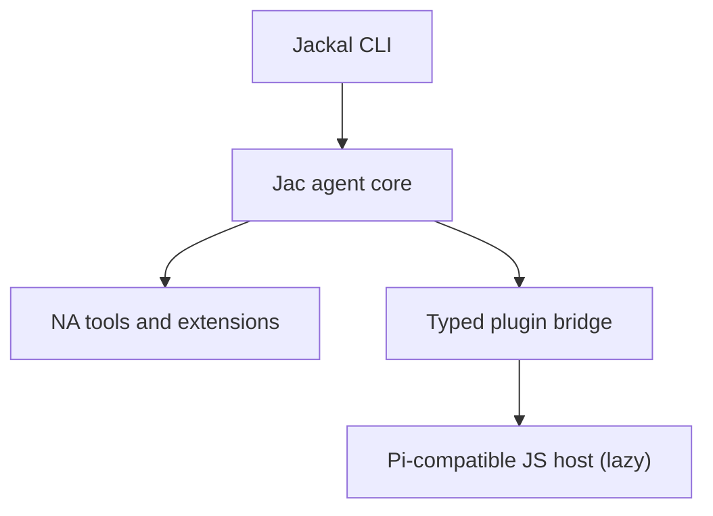

# Jackal Roadmap

**Updated:** 2026-08-21
**Product:** a fast native coding agent with a compatible JavaScript extension layer.

> **Positioning:** fx's form factor + Pi's ecosystem + Jac's codespace architecture. Jackal starts as a small native runtime with instant startup and Unix-tool ergonomics; JavaScript extensions run in a lazily-spawned Pi-compatible host off the default startup path. See [`docs/NA-HARNESS-EXPLORATION.md`](docs/NA-HARNESS-EXPLORATION.md) for the decision record and [`docs/decisions.org`](docs/decisions.org) for the full decision log.

---

## 0. Positioning

**A fast native coding agent with a compatible JavaScript extension layer.**
Or more aggressively: *native where performance matters, JavaScript where compatibility matters.*

The reference point is Vercel's [fx](https://github.com/vercel-labs/fx): a ~8 MiB native binary, effectively instant startup, minimal terminal interface, native/Wasm builds, ACP embedding, skills/MCP/subagents. fx validates the demand for native-minimal agents (~1.8K stars in three days). Jackal goes beyond it:

| Capability | fx | Jackal |
|---|---|---|
| Small native executable | Yes | Yes |
| Unix-like terminal UX | Yes | Yes |
| Native/Wasm portability | Yes | Yes, demonstrated through Jac |
| Embeddable agent core | Yes | Yes |
| Skills and MCP | Yes | Yes |
| Existing Pi extensions | No documented compatibility | **Yes** |
| Native extension path | Zig/core contribution | Jac `na` plugins |
| Mixed-runtime extension system | Limited | **Core architectural feature** |

Emulate fx's: restrained interaction, single executable, noninteractive mode, structured JSON output, ACP surface, ruthless startup-time and binary-size benchmarks. Do not imitate its branding or lead with "tiny" — tininess eventually conflicts with compatibility. The differentiator is the mixed-runtime extension story, which is also why codespaces exist.

Architecture rule: **JavaScript must never be on Jackal's default startup path.**



- The JS host starts lazily only when a user loads a JavaScript extension.
- Communication crosses a stable typed event/tool API.
- Existing Pi extensions receive a compatibility implementation of Pi's API.
- Performance-sensitive extensions can migrate to Jac/NA without changing the plugin model.
- Do not ship an embedded Node runtime inside the binary (undermines the small-native positioning); QuickJS would be smaller but breaks Node built-ins/npm/native packages — a lazily spawned Node host is the pragmatic first implementation.

## 1. Target product

Jackal must be good enough to replace Pi for daily Jac development. A line REPL is not the product.

The target experience includes:

- responsive streaming transcript
- editor-quality multiline input, history, paste, Unicode, and IME behavior
- visible tool timeline with cancellation and approvals
- diff review before destructive changes
- model, mode, session, and context status
- command palette, help, selectors, and overlays
- persistent sessions and reconnect/recovery behavior
- Jac toolchain and MCP integration
- skills, subagents, tasks, checkpoints, and compaction
- clean operation in common terminals, tmux, and SSH

## 2. Target architecture

```text
User terminal
    │
    ▼
custom Jac TUI (server placement)
    │  typed commands/events
    ▼
Jackal session host (server placement)
    ├─ owned ReAct loop + LLM transport
    ├─ tools, approvals, sessions, MCP
    ├─ Cordis composition context
    └─ app/core/* measured kernels (native placement)
```

### Ownership

| Concern | Owner |
|---|---|
| Session, turn, model, tool, approval, persistence truth | Jac brain |
| Focus, layout, selection, scroll, animation, theme | TUI renderer |
| Transport framing | Adapter (in-process, JSONL, or in-memory) |
| Pure measured hot paths | `app/core/` native kernels |

### UI framework model

Jackal will implement a compact framework modeled on Pi's differential TUI:

```text
render(width) -> list[str]
handle_input(data)
invalidate()
```

Components render width-bounded ANSI lines. The framework composes focus and overlays, compares the frame with the previous frame, and emits one synchronized ANSI update for the changed range.

The component structure and reactive invalidation backend is OSP-native: data-only `UiNode` values use ordered typed `Child` edges, source signals use `Feeds` edges, and process-local render/input closures live outside graph nodes. A thin projection implements `render(width)`, `handleInput(data)`, and `invalidate()`. OSP owns structure and lifecycle; cached flat `list[str]` frames and ANSI comparison remain the renderer hot path.

The TUI uses Python standard-library terminal support through server Jac. C is not required for rendering. Narrow C FFI or native kernels are permitted only for a platform gap or measured performance need.

## 3. Binding decisions

1. **All new product work lands in `app/`.**
2. **`src/` and `templates/` stay runnable only as migration reference** until the cutover gate.
3. **The line REPL is a debug adapter**, not a milestone UX.
4. **The Ink JSONL client is temporary**, used to exercise the seam while the Jac TUI is built.
5. **MCP uses `jac mcp` as a subprocess** from N2 onward; an in-process rewrite needs profiling evidence.
6. **Native remains kernel-only and profiling-gated.**
7. **Small-binary discipline over single-file maximalism.** Keep the default startup path free of JavaScript. Do not embed a Node runtime in the shipped binary; spawn the Pi-compatible JS host lazily on demand.
8. **Cordis is the composition model**, but product usability precedes dynamic loading and self-evolution.

## 4. Current state

### Landed

- [x] All-Jac application root under `app/`
- [x] Owned ReAct loop and injectable HTTP transport
- [x] Initial read/write/edit/bash tool surface
- [x] Term and JSONL adapters
- [x] Native edit-kernel spike in `app/core/edit.jac`
- [x] Temporary Ink JSONL client in `tui/`
- [x] Cordis C0 core with revertible effects and reactive coeffects
- [x] OSP UI backend slice: ordered tree, source signals, cached projection, disposal, differential-renderer smoke
- [x] Legacy TS/Ink Jackal remains available as parity reference

### Known gaps in the new path

- Product TUI framework does not exist yet
- Agent execution is synchronous with the UI host
- UI protocol lacks durable IDs, ordering, snapshots, cancellation, approvals, and backpressure
- Session persistence, safety modes, MCP, skills, orchestration, and compaction remain to port
- Packaging and clean-machine installation for the new path are not settled

## 5. Delivery phases

Phases are sequential gates. Work inside one phase can proceed in parallel when it does not create a second source of truth.

### N0 — Harness vertical slice — **landed**

**Goal:** prove that Jac can own the agent loop and expose renderer-neutral events.

Deliverables:

- owned ReAct loop
- streaming model transport
- core file and shell tools
- term and JSONL adapters
- native edit-kernel call from server code

Acceptance:

- a three-turn session can inspect and edit a file
- tool calls and model text stream as events
- term and JSONL adapters consume the same session loop

### N1 — Jac TUI foundation

**Goal:** prove that a direct Jac/ANSI framework can meet the product quality bar without Ink, Textual, or a C renderer.

Deliverables:

- `Terminal` interface with process and virtual adapters
- raw mode, resize, bracketed paste, terminal restoration
- complete input-sequence buffering and key normalization
- `Component` interface: render, input, invalidation
- width-bounded line rendering and ANSI/Unicode utilities
- focus and overlay stack
- differential renderer with synchronized output and frame coalescing
- UI event loop separated from agent execution
- typed command/event envelopes with stable IDs and sequence numbers

Acceptance:

- no flicker during sustained streaming
- resize during streaming preserves transcript and editor state
- Unicode, multiline paste, history, and cursor movement work in a PTY
- Ctrl-C/Escape can cancel an active turn while the UI remains responsive
- terminal state is restored after normal exit and forced failure
- virtual-terminal tests cover first render, append, mutation, shrink, resize, and overlays

**Stop/go gate:** do not begin a broad feature port until this phase demonstrates a credible transcript and editor against a real provider.

### N2 — Daily-driver core

**Goal:** make the all-Jac path safe and useful for daily work.

Deliverables:

- transcript, markdown, tool timeline, status, notifications
- editor autocomplete and command palette
- session persistence, restore, rename, resume, and export
- turn abort and subprocess-group cancellation
- normal, auto-accept, yolo, plan, and ask modes
- tool approval and structured diff review
- Jac check/format/test/run workflows
- `jac mcp` subprocess integration and status
- typed startup snapshot and capability negotiation
- bounded queues and text-delta coalescing

Acceptance:

- restart restores session, model, and transcript
- a destructive tool waits for a correlated approval decision
- `/fix` performs check → edit → verify with a retry cap
- MCP failure degrades clearly without freezing the TUI
- a full coding turn can be aborted during model streaming or a long-running tool

### N3 — Feature parity and cutover

**Goal:** port the proven daily workflows and retire the legacy runtime safely.

Deliverables:

- `@file`, line ranges, command output context, and file explorer
- context usage and automatic/manual compaction
- checkpoints and tasks
- project configuration and permission patterns
- skills and custom commands
- subagents and chains
- auth/provider flows
- headless `jackal run`
- session-data migration or explicit compatibility policy
- clean launcher, install, upgrade, and recovery documentation

Acceptance:

- the all-Jac path passes the agreed parity matrix against the legacy shell
- no daily workflow requires `src/`, `templates/`, or jac-ink
- existing session data is migrated, read compatibly, or intentionally archived
- default `jackal` launch uses `app/`
- legacy runtime removal is a separate, reviewable commit after the gate passes

### N4 — Composition and extensibility integration

**Goal:** integrate the landed Cordis model into stable product interfaces. Cordis research and reversible prototypes may proceed earlier, but must not block N1–N3 or make unstable UI/session interfaces permanent.

Deliverables:

- componentize tool suites, renderer, transport, and session host as fibers
- derive active tools from live `tools.*` provisions
- `.jackal/components.toml` loader and reconciliation
- recovery tests proving unload restores context
- hot swap with state preservation
- optional agent-managed component deployment behind approvals

Acceptance:

- unloading a tool suite removes it from the next turn and reverts its effects
- swapping a renderer does not lose the session
- configuration changes reconcile to quiescence without restart
- `dispose_all` restores an empty composition context

See [`docs/CORDIS-DESIGN.md`](docs/CORDIS-DESIGN.md).

### N5 — Profiled kernels and optional surfaces

**Goal:** optimize only measured bottlenecks and add non-terminal adapters only after terminal parity.

Candidates:

- diff/edit
- ANSI width and wrapping
- frame comparison/composition
- token estimation
- markdown block parsing

Optional surfaces:

- Jac Desktop/web renderer over the same typed session interface
- remote/daemon transport if live reattachment becomes a requirement
- in-process MCP only if subprocess overhead is material

Acceptance:

- every new native pin has an end-to-end benchmark and regression test
- no optimization moves session or policy truth out of the brain
- optional renderers consume the same command/event interface

## 6. Workstreams

### TUI quality

- terminal lifecycle and restoration
- input correctness across terminal protocols
- virtual-terminal and PTY test harness
- editor, transcript, markdown, overlays, and diff UI
- cached rendering and bounded frame rate

### Agent parity

- sessions and compaction
- safety modes and permissions
- tools, MCP, and Jac workflows
- skills, tasks, checkpoints, and subagents

### Composition

- Cordis component interfaces
- loader and recovery semantics
- hot swap and later self-evolution

### Native kernels

- benchmark first
- pin narrowly
- keep server/native crossings coarse and batched

## 7. Cutover policy

The migration is intentionally asymmetric:

| Path | Policy |
|---|---|
| `app/` | Active product development |
| `tui/` | Temporary protocol client; minimal investment |
| `src/` + `templates/` | Frozen parity reference; critical fixes only |
| `lib/jac/` bridge migration | Superseded; do not expand |
| `app/core/` | Native experiments with benchmark gates |

Do not mix unrelated legacy bridge edits into all-Jac feature commits.

## 8. Non-goals

- A line-oriented product interface
- Restoring jac-ink or the removed Jac plugin system
- Rewriting the agent loop in native Jac
- A broad C FFI terminal layer
- A single executable containing HTTP, model providers, MCP, and the TUI
- Full IDE/LSP replacement
- Desktop UI before terminal daily-driver parity

## 9. Immediate next milestone

Build the N1 vertical slice:

```text
real Terminal + virtual Terminal
        ↓
raw input parser + component tree
        ↓
differential renderer
        ↓
transcript + multiline editor
        ↓
typed in-process session adapter
```

The milestone is complete only when a real-provider streaming turn, resize, multiline paste, cancellation, and terminal restoration work in the Jac TUI.

## 10. Related documents

| Document | Role |
|---|---|
| [`docs/NA-HARNESS-EXPLORATION.md`](docs/NA-HARNESS-EXPLORATION.md) | Codespace and UI decision record |
| [`docs/CORDIS-DESIGN.md`](docs/CORDIS-DESIGN.md) | Dynamic composition design |
| [`docs/FEATURES.md`](docs/FEATURES.md) | Historical legacy-runtime feature inventory |
| [`docs/CONSOLIDATION_PLAN.md`](docs/CONSOLIDATION_PLAN.md) | Historical TS consolidation plan, now superseded |
| [`AGENTS.md`](AGENTS.md) | Repository rules and architecture map |
