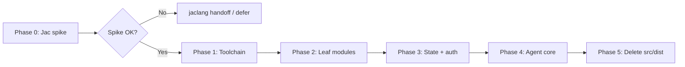

# Jackal: TypeScript → Jac Core Migration Plan

**Status:** Phase 0–2 complete; Phase 3 in progress (core + session modules ported); Phase 4–5 future
**Last updated:** 2026-05-26  
**Decision (2026-05-24):** Hold full migration until feature-complete. Phase 0 spike + Phase 1 toolchain modules may proceed in parallel with TypeScript work.

**Related:** [PLAN.md](./PLAN.md) · [FEATURES.md](./FEATURES.md) · [NANOCODER-PARITY.md](./NANOCODER-PARITY.md) · [JAC-AI-PARITY.md](./JAC-AI-PARITY.md) · [JAC-TUI.md](./JAC-TUI.md)

---

## Executive summary

Jackal’s long-term shape is a **Jac-native agent runtime** with an **Ink UI in `.cl.jac`**. The decided migration replaces the TypeScript headless runtime (`src/` → `tsc` → `dist/index.js`) with server-side Jac modules under `lib/jac/`.

**This migration is not happening now.** Ship features in TypeScript until the feature-complete bar is met, then run a Phase 0 feasibility spike before committing to the full port.

**Two separate decisions — do not conflate them:**

| Decision | Status |
|----------|--------|
| Rewrite runtime **language** from TypeScript to Jac | **Decided** — this doc |
| Replace **`pi-agent-core` / `pi-ai`** with Jac/byLLM (`jac ai` loop) | **Separate future decision** — see [JAC-AI-PARITY.md](./JAC-AI-PARITY.md) |

During migration, `pi-agent-core` and `pi-ai` stay as npm deps via `jac.toml` until Jac-native alternatives exist and are validated.

---

## What pi-agent-core is (and what Jackal owns)

`@earendil-works/pi-agent-core` is a small **ReAct loop + event stream** built on `pi-ai`:

```
prompt → transformContext → convertToLlm → stream LLM → tool calls → repeat → agent_end
```

It does **not** include file editing, MCP, LSP, auth UI, sessions, subagents, or the Ink shell. Jackal wraps it in `JackalAgentSession` (`src/session/agent-session.ts`) and supplies all product logic around the loop.

**Target:** move that wrapper and everything it depends on into Jac. The loop itself may remain `pi-agent-core` (via npm interop) until a byLLM replacement is chosen.

---

## Decisions

| Topic | Decision |
|-------|----------|
| Pi-style extension system | **Not on roadmap.** Skills, subagents, chains, `.jackal` config, and custom commands are sufficient customization. |
| Agent implementation language | **Jac** — replace `src/` (TypeScript headless runtime, ~13.4k LOC across 56 files). |
| Ink UI | **Stay `.cl.jac`** — already Jac; target in-process agent (no external `dist/index.js`). |
| npm deps (`pi-agent-core`, `pi-ai`) | **Keep** via `jac.toml` until Jac-native alternatives exist. |
| Dual runtime during deferral | **No.** Do not wire `lib/jac/` into `jackal.sh`; avoid dual maintenance. |

---

## Architecture

### Today

```
jackal.sh
  → npm run build:agent (tsc)
  → node dist/index.js          # headless adapter
  → @jac/pi facade              # jac-ink virtual hooks
  → templates/shell.cl.jac      # Ink UI
```

### Target

```
jackal.sh
  → jac run | jac tui
  → lib/jac/*                   # agent core (in-process)
  → templates/shell.cl.jac      # Ink UI
```

**Removed when complete:** `src/`, `dist/`, `tsconfig.json`, `npm run build:agent` from launch path.

---

## Timing: defer until feature-complete

### While deferred

- **Primary runtime:** `src/` + `tsc` → `dist/` — all new agent work lands here
- **`lib/jac/`:** Planned target layout; not wired into launch path until migration starts
- **No Phase 0 spike** until feature-complete review — unless npm/Jac interop becomes a blocker

### Feature-complete bar (when to reopen migration)

Use [NANOCODER-PARITY.md](./NANOCODER-PARITY.md) + [ROADMAP.md](../ROADMAP.md) as the checklist. Revisit when **Track A foundation is done** and remaining gaps are explicitly deferred or N/A.

| Must be done (reopen migration) | OK to defer past migration |
|---------------------------------|----------------------------|
| Track A P0–P8 stable, no known regressions in daily use | Scheduler, `/tune`, custom tools |
| Nanocoder polish: bash streaming, gitignore search, shutdown lifecycle | VS Code bridge, model DB |
| LSP tools usable for Jac projects (ROADMAP P9 scope) | Structured logging / pino-style infra |
| Subagents, MCP, sessions, checkpoints, modes — solid | Web search/fetch |
| `./jackal.sh --check` + `jackal run` reliable in CI | |

**Trigger to restart:** Feature-complete review → Phase 0 spike → if spike passes, execute Phases 1–5.

### Why defer (not migrate ASAP)

| Risk | Detail |
|------|--------|
| Unproven interop | Server-side Jac importing `pi-agent-core` / `pi-ai` is assumed but not validated in this repo. Failed spike → jaclang handoff, not a migration. |
| ~13.4k LOC | Full rewrite blocks feature velocity and invites regressions. |
| Moving target | `agent-session`, tools, and approval paths are the most complex code; porting while redesigning means porting twice. |
| Test churn | ~20 vitest adapter tests + TUI compile smoke assume `dist/index.js`. Dual stacks double CI cost. |

### Why not wait forever

| Cost | Detail |
|------|--------|
| Migration debt | Every new TS feature in `src/` must be rewritten in Jac later. |
| Awkward split | Jac UI + TS brain + JS facade is the wrong long-term shape for a Jac-native product. |
| Identity | Jackal should dogfood Jac as a systems language, not only as the language it edits. |

---

## Phases



### Phase 0 — Feasibility spike (days)

**Goal:** Answer “can Jac host the agent loop?” before committing.

| Task | Deliverable |
|------|-------------|
| `lib/jac/spike/agent_spike.jac` | Import `pi-agent-core`, run one headless turn |
| Document npm interop gaps | Issue or handoff to jaclang if blocked |
| Optional `./jackal.sh --check` path | Exercise Jac toolchain module |

**Exit:** Go/no-go for Phase 1.

### Phase 1 — Wire Jac toolchain modules

**Goal:** Single source of truth for Jac CLI helpers; delete TS duplicates in `src/jac/`.

| Task | Deliverable |
|------|-------------|
| Port `jac_cli`, `jac_doctor`, `jac_workflows`, `jac_types` | `lib/jac/jac/*.jac` |
| Wire into runtime | TS calls Jac or headless entry uses Jac directly |
| Delete `src/jac/jac-cli.ts`, `jac-types.ts`, etc. | No duplicate implementations |
| Port/replace `tests/adapter/jac-cli.test.ts` | Green CI |

### Phase 2 — Leaf modules

**Goal:** Port config, workflow, orchestration metadata, project helpers, UI helpers.

No changes to `agent-session` or Ink shell contract.

| Area | TS source | Jac target |
|------|-----------|------------|
| Config | `config/project-config.ts` | `lib/jac/config/project_config.jac` |
| Workflow | `workflow/*.ts` | `lib/jac/workflow/*.jac` |
| Orchestration metadata | `orchestration/subagents.ts`, `chains.ts`, `frontmatter.ts` | `lib/jac/orchestration/*.jac` |
| Project | `project/*.ts` | `lib/jac/project/*.jac` |
| Agent helpers | `agent/system-prompt.ts`, `dev-mode.ts`, etc. | `lib/jac/agent/*.jac` |
| UI helpers | `ui/completions.ts`, `overlay-rows.ts`, etc. | `lib/jac/ui/*.jac` |
| Render | `render/mermaid-render.ts` | `lib/jac/render/mermaid_render.jac` |

### Phase 3 — State + auth + session storage

**Goal:** Store, bridge, UI context, auth flow, session manager on Jac.

| Module | TS source | Jac target |
|--------|-----------|------------|
| Store | `core/store.ts` | `lib/jac/core/store.jac` |
| Bridge | `core/bridge.ts` | `lib/jac/core/bridge.jac` |
| UI context | `core/ui-context.ts` | `lib/jac/core/ui_context.jac` |
| Agent busy | `core/agent-busy.ts` | `lib/jac/core/agent_busy.jac` |
| Auth | `auth/*.ts` | `lib/jac/auth/*.jac` |
| Session | `session/session.ts`, `session-index.ts` | `lib/jac/session/*.jac` |

**Critical constraint:** Freeze `AgentSnapshot` shape before Phase 4 — Ink components depend on it.

### Phase 4 — Agent core

**Goal:** Tools, approvals, subagents, compaction, MCP/LSP, `agent_session.jac`.

Port only after Gate 3 (API stable). Longest phase.

| Module | TS source | Jac target | Notes |
|--------|-----------|------------|-------|
| Agent session | `session/agent-session.ts` | `lib/jac/session/agent_session.jac` | Largest module |
| Compaction | `session/auto-compact.ts`, `llm-compact.ts` | `lib/jac/session/*.jac` | |
| Tools | `agent/tools.ts` | `lib/jac/agent/tools.jac` | |
| Subagent tool | `agent/agent-tool.ts` | `lib/jac/agent/agent_tool.jac` | |
| Approvals | `agent/tool-approval.ts`, `subagent-approval.ts` | `lib/jac/agent/*.jac` | |
| Permissions | `agent/session-permissions.ts` | `lib/jac/agent/session_permissions.jac` | |
| MCP | `agent/mcp-client.ts` | `lib/jac/agent/mcp_client.jac` | May keep thin Node bridge |
| LSP | `jac/lsp-client.ts`, `lsp-service.ts` | `lib/jac/jac/*.jac` | May keep thin Node bridge |
| Subagent runner | `orchestration/subagent-runner.ts` | `lib/jac/orchestration/subagent_runner.jac` | |

`@jac/pi` facade reads Jac-compiled agent (or shell imports agent modules directly).

### Phase 5 — Decommission TypeScript runtime

**Goal:** Remove `src/`, `dist/`, `tsc` from launch path.

| Task | Deliverable |
|------|-------------|
| `jackal.sh` | `jac run` / `jac tui` only |
| Entry | `lib/jac/main.jac` replaces `core/adapter.ts` + `index.ts` |
| CLI | `lib/jac/cli/run.jac` replaces `cli/run.ts` |
| Tests | Adapter vitest suite migrated or replaced |
| Docs | Update PLAN, FEATURES, AGENTS, ROADMAP |

---

## Phase gates

### Gate 0 → Phase 1

- [x] `jac run` can import npm `@earendil-works/pi-agent-core` and create an `Agent` instance (via Node bridge: `lib/jac/spike/npm_agent_spike.mjs`)
- [x] One automated turn completes (prompt → `agent_end`) from Jac entry `agent_spike.jac` → Node bridge + faux provider (no API keys)
- [x] `./scripts/jac-toolchain-check.sh` / `npm run check:jac` — toolchain + headless agent turn via `lib/jac/main.jac --check` + separate `lib/jac/tests` harness (`scripts/jac-test-harness.sh`) (GitHub Actions: `.github/workflows/jac-toolchain.yml`)

### Gate 1 → Phase 2

- [x] Toolchain Jac modules ported: `lib/jac/jac/{types,cli,doctor,workflows,lsp_config}.jac`
- [x] TS `src/jac/{jac-cli,jac-doctor,jac-workflows,jac-types,lsp-service}.ts` delegate to `lib/jac/jac/_*_toolchain.py` via `lib/jac/bridge/toolchain_stdio.py`
- [x] Jac tests: `lib/jac/tests/cli_test.jac`; vitest: `tests/adapter/jac-cli.test.ts`, `jac-workflows.test.ts`, `lsp-service.test.ts`
- [ ] LSP transport (`lsp-client.ts`, `lsp-tools.ts`, `JacLspService` class) — stays in TS until Phase 4 (Node `vscode-languageserver-protocol`)
- [ ] Delete thin TS shim files in `src/jac/` once Jac can host the full runtime (Phase 5)

### Gate 2 → Phase 3

- [x] Leaf modules ported (config, tasks, checkpoints, orchestration metadata) — 28 Python toolchain modules total
- [x] Group 2A progress: `lib/jac/project/{gitignore,file_explorer}.jac` + TS bridge delegation
- [x] Store snapshot shape documented and frozen (see `AgentSnapshot` interface in `src/core/store.ts`)
- [x] Phase 3 core + session modules ported: `lib/jac/{core,session}/` — tool_summary, auto_compact, session_index

### Gate 3 → Phase 4

- [ ] `store`, `bridge`, `ui-context`, `auth-flow` running in Jac
- [ ] `@jac/pi` facade reads Jac-compiled agent (or shell imports agent directly)
- [ ] Agent-session public API stable (no pending redesign of approval, compaction, or subagent wiring)

### Gate 4 → Phase 5

- [ ] Full interactive TUI + `jackal run` + `--check` on Jac-only path
- [ ] Adapter vitest suite migrated or replaced
- [ ] `npm run build:agent` / `dist/` removed from `jackal.sh`

---

## Target layout

```
jackal/
├── lib/jac/                      # agent core (server-side .jac)
│   ├── main.jac                  # CLI: --check, run, headless entry
│   ├── spike/
│   │   └── agent_spike.jac       # Phase 0 feasibility
│   ├── core/
│   │   ├── store.jac
│   │   ├── bridge.jac
│   │   └── ui_context.jac
│   ├── session/
│   │   ├── agent_session.jac
│   │   └── session.jac
│   ├── agent/
│   ├── auth/
│   ├── workflow/
│   ├── orchestration/
│   ├── project/
│   └── jac/                      # jac_cli, doctor, workflows, lsp
├── templates/
│   └── shell.cl.jac              # Ink UI
├── jac.toml                      # npm: pi-agent-core, pi-ai, ink, react
├── jackal.sh                     # jac run / jac tui (no tsc)
└── pi/                           # package data: skills, SYSTEM.md, mcp.json
```

---

## What to finish in TypeScript first

Ship before porting `agent-session` — low migration risk, improves daily use:

| Item | Why TS first | Parity ref |
|------|--------------|------------|
| Markdown / text wrapping polish | Mostly `templates/` + `markdown.mjs` | NANOCODER §2 |
| Bash streaming output in tool UI | Ink components; minimal session changes | NANOCODER §2 |
| `.gitignore`-aware file search | Isolated `file-explorer` module | NANOCODER §3 |
| Graceful shutdown / lifecycle | Small session hook; port once cleanly | NANOCODER §1 |

## What to defer until Jac (or skip in TS)

Do not build large new subsystems in TypeScript if migration is likely within one quarter:

| Item | Reason |
|------|--------|
| Structured logging (pino-style) | Infrastructure — build once in Jac |
| Scheduler / cron | New subsystem; high port cost |
| Custom tools registry | Explicitly out of scope (no extension system) |
| Model database / `/tune` | Optional; low priority |
| VS Code bridge | Not planned (terminal-first) |

## What to build only once (in Jac)

When migration accelerates, **new agent-core features go in Jac only** — no parallel TS implementation:

- LSP depth improvements
- Autocheck / plan-mode hook refinements
- MCP lifecycle changes
- Subagent runner changes
- `CodeIntelligence` semantic tools (see [JAC-AI-PARITY.md](./JAC-AI-PARITY.md))

**Rule:** Each ported module ships with parity tests before TS deletion. Delete TS when Jac is wired — never maintain both.

---

## jac-ink handoff (human-owned)

These belong in `~/repos/jac-tui/jac-ink`, not in jackal agent work:

| Item | Why |
|------|-----|
| In-process agent in tui bundle | Drop `JACKAL_AGENT_DIST` external adapter |
| `@jac/pi` → Jac modules | Facade imports compiled agent, not `dist/index.js` |
| Formal adapter / entry config | `jac.toml` agent entry point vs shell-only entry |

See [JAC-TUI.md](./JAC-TUI.md).

---

## Test strategy

| Layer | Today | Target |
|-------|-------|--------|
| Unit (store, bridge, parsers) | vitest + TS | Jac tests or `jac run` harness per module |
| Smoke | `runNextAgentSmoke` via `dist/index.js` | `jac run lib/jac/main.jac --check` |
| TUI | ink-testing-library + compile fixtures | Unchanged — snapshot contract must hold |
| Integration | `./jackal.sh --check` | Same command; Jac backend |

---

## Risks

| Risk | Mitigation |
|------|------------|
| Jac cannot import `pi-agent-core` | Phase 0 spike; upstream handoff to jaclang |
| Dual maintenance (`src/` + `lib/jac/`) | Strict delete-on-wire rule; no new features in both |
| Ink regression | Freeze store snapshot schema in Phase 3 |
| LSP/MCP Node I/O | Thin bridge modules; port logic to Jac, keep transport in Node if needed |
| Migration stalls mid-flight | Phase gates; TS remains launch path until Phase 5 complete |

---

## Out of scope

- Pi-style extension / plugin host
- VS Code bridge
- Scheduler, `/tune`, custom tools registry (unless rebuilt natively in Jac post-migration)
- Replacing `pi-agent-core` / `pi-ai` with byLLM (separate decision — [JAC-AI-PARITY.md](./JAC-AI-PARITY.md))

---

## Immediate next steps (while deferred)

1. **Ship toward feature-complete** — see [NANOCODER-PARITY.md](./NANOCODER-PARITY.md) gaps and [ROADMAP.md](../ROADMAP.md) P9 scope.
2. **Keep one runtime** — TypeScript only; do not wire `lib/jac/` into `jackal.sh`.
3. **When feature-complete:** Re-read this doc → Phase 0 spike → go/no-go → Phases 1–5.

---

## Quick reference

| Question | Answer |
|----------|--------|
| Migrate now? | **No** — deferred until feature-complete |
| What to build in? | **TypeScript** (`src/`) exclusively |
| `lib/jac/`? | **Phase 0–1 active** — run `./scripts/jac-toolchain-check.sh`; not wired into `jackal.sh` yet |
| When to reopen? | Feature-complete review → Phase 0 spike |
| Drop pi-agent-core? | **Not in this migration** — separate future decision |
| Extensions? | **Off roadmap** — skills/subagents/config are enough |
